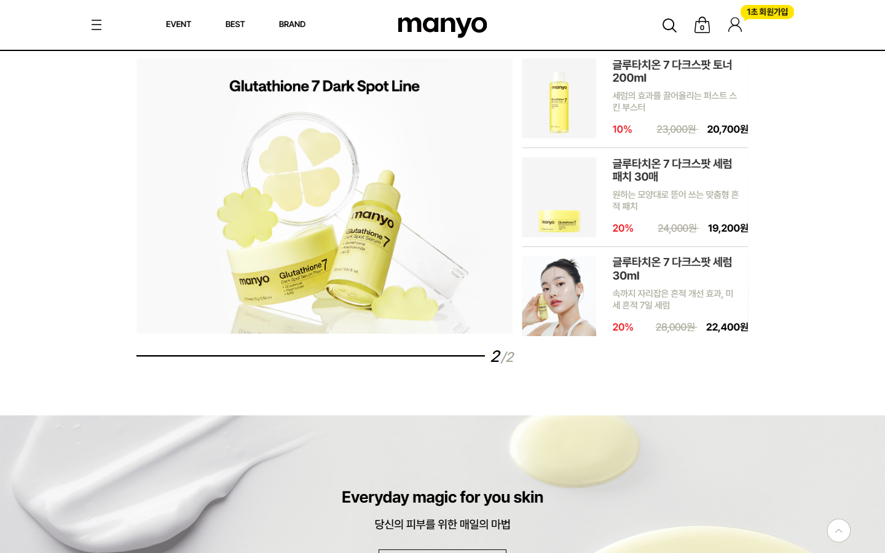
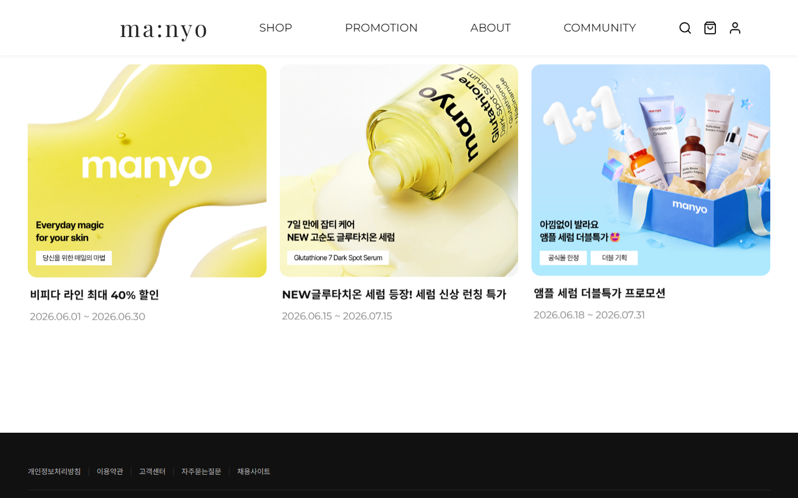

# 마녀공장 리디자인 | ma:nyo

마녀공장(MANYO FACTORY) 공식 쇼핑몰을 레퍼런스로 삼아, 프론트엔드 마크업과 UI 구현 역량을 다지기 위해 진행한 개인 프로젝트입니다. 실제 서비스를 직접 사용해보며 발견한 개선점을 반영하여 화면을 다시 설계하고 구현했습니다.

> 이 프로젝트는 (주)마녀공장과 관련이 없는 개인 학습/포트폴리오용 사이트이며, 상업적 목적이 없습니다. 실제 브랜드 이미지를 학습용으로 참고했습니다.

## 데모

- 배포 링크: https://dohyeonl.github.io/manyo-redesign/

## 사용 기술

- HTML5 / CSS3 (Flexbox, Grid, 반응형 미디어쿼리)
- Vanilla JavaScript
- Swiper.js (상품 캐러셀)
- Google Fonts

## 주요 기능

- 반응형 레이아웃 (PC / 태블릿 / 모바일 대응, 768px 이하에서는 햄버거 메뉴로 전환)
- Swiper로 만든 Best Product 캐러셀 + 진행바
- 추천 상품 필터 버튼 (MD추천 / 프로모션 특가 / 꿀조합 SET)
- IntersectionObserver로 스크롤하면 콘텐츠가 페이드인되는 효과
- 키보드로 Tab 눌러도 드롭다운 메뉴가 열리도록 처리
- 검색 아이콘 클릭 시 검색창 토글

## 리디자인 배경

실제 서비스를 화면 단위로 사용해보며 느낀 불편함을 출발점으로 삼아, 각 지점에서 무엇이 문제였고 이를 어떻게 다르게 설계했는지 정리했습니다.

### 1. 진입 화면 — 브랜드 정체성을 한눈에

원본 사이트의 히어로 영역은 상품 이미지를 활용한 배너가 자동으로 전환되는 캐러셀로 구성되어 있습니다. 배너를 하나씩 확인해보니 전부 상품 상세 페이지로 연결되는 구조였는데, 정작 사진만 봐서는 이것이 프로모션·이벤트를 안내하는 배너인지 단순히 상품 구매를 유도하는 배너인지 구분이 되지 않았습니다.

리디자인에서는 첫 화면에서 브랜드의 정체성을 명확하게 전달하는 데 초점을 맞춰, 고정된 브랜드 배너 하나만을 두어 방문 시점과 무관하게 일관된 브랜드 이미지를 전달하도록 구성했습니다.

<table>
  <tr>
    <th align="center">Before (원본)</th>
    <th align="center">After (리디자인)</th>
  </tr>
  <tr>
    <td></td>
    <td></td>
  </tr>
</table>

### 2. 상품 노출 방식 — Recommended Products 섹션 신설

원본 사이트는 상품을 소개하는 영역이 "지금 가장 사랑받는 제품" 섹션 하나로 한정되어 있었습니다.

리디자인에서는 여기에 더해 할인 프로모션이 적용된 상품과 세트로 구성하면 좋은 상품까지 함께 보여주는 Recommended Products 섹션을 새로 구성했습니다. 상품 노출 영역을 넓혀 사용자가 둘러보는 상품의 폭을 넓히고, 이를 통해 매출 상승 효과까지 기대할 수 있도록 설계했습니다.

<table>
  <tr>
    <th align="center">Before (원본 — Best Product 하나뿐)</th>
    <th align="center">After (리디자인 — Recommended Products 추가)</th>
  </tr>
  <tr>
    <td></td>
    <td></td>
  </tr>
</table>

### 3. 이벤트·프로모션 노출 — 메인 화면에 상시 노출

원본 사이트는 진행 중인 이벤트·프로모션을 확인하려면 EVENT 카테고리로 따로 진입해야 하며, 메인 화면에서는 전혀 노출되지 않습니다.

리디자인에서는 현재 진행 중인 이벤트와 프로모션을 메인 화면에 바로 노출시켜, 사용자가 별도 페이지로 이동하지 않아도 한눈에 확인할 수 있도록 구성했습니다. 이를 통해 프로모션에 대한 사용자의 클릭률 상승을 기대할 수 있습니다.

<table>
  <tr>
    <th align="center">Before (원본 — EVENT 카테고리 진입 필요)</th>
    <th align="center">After (리디자인 — 메인 화면 상시 노출)</th>
  </tr>
  <tr>
    <td></td>
    <td></td>
  </tr>
</table>

## 폴더 구조

```
마녀공장_리디자인/
├─ index.html
├─ style.css
├─ script.js
├─ images/        # 사이트에서 실제로 쓰는 이미지
└─ docs/compare/  # README 비교 이미지 (원본 vs 리디자인)
```

## 실행 방법

1. 저장소를 다운로드 또는 clone
2. index.html을 브라우저로 열면 바로 확인 가능 (VS Code Live Server 사용 추천)

## 앞으로 더 해보고 싶은 것

- 이미지 용량 최적화 (webp 변환)
- 상품 상세 페이지 만들어보기
