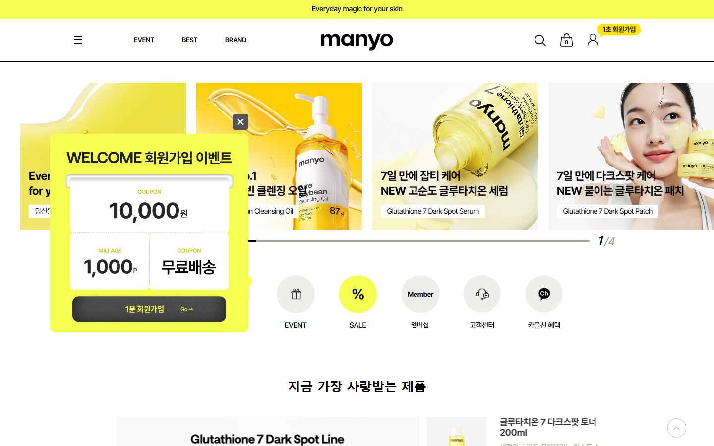
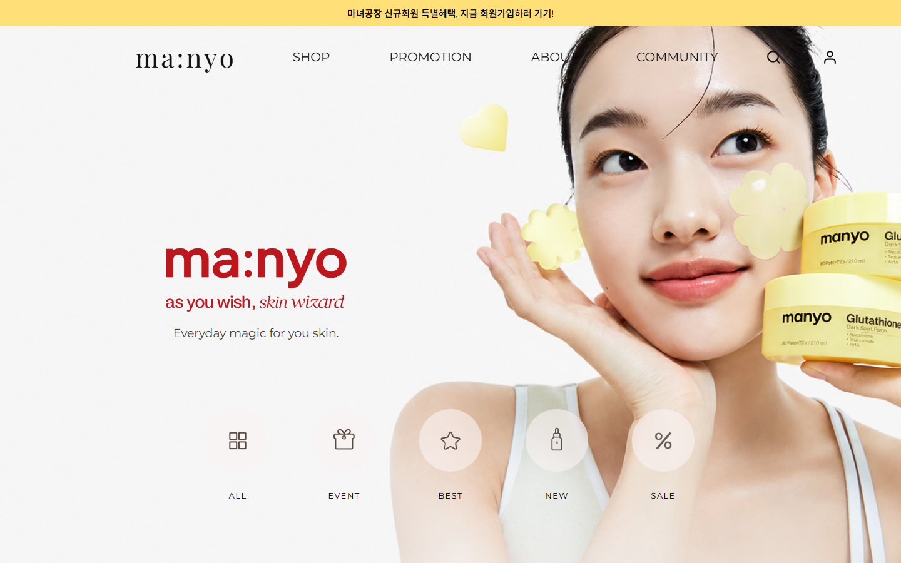
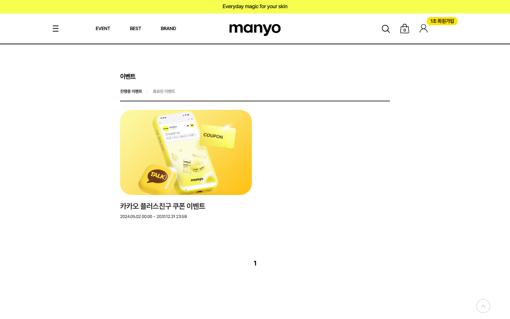
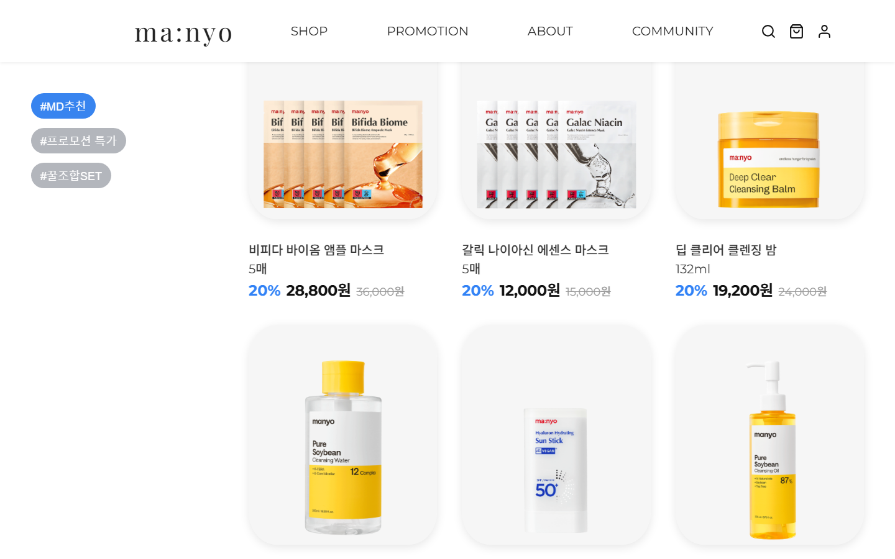
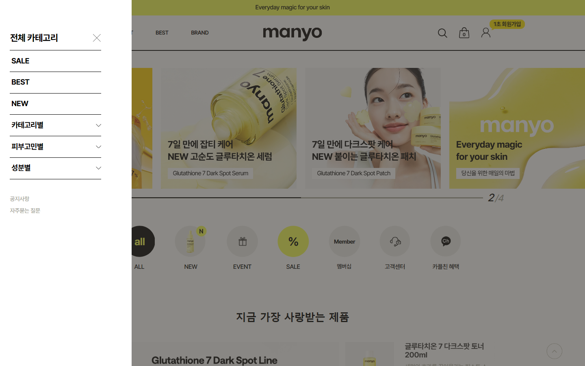
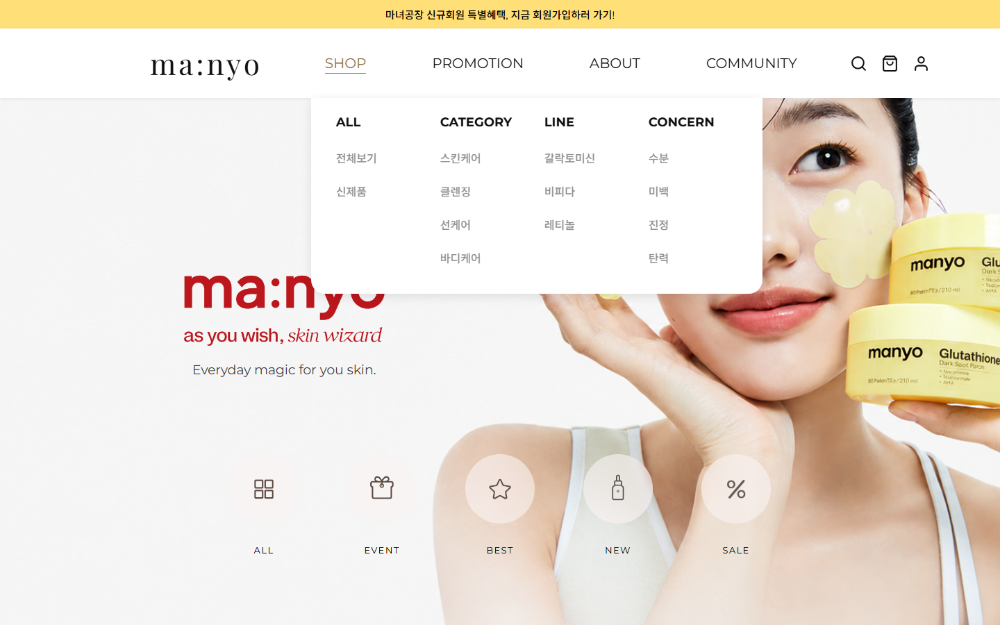

# 마녀공장 리디자인 | ma:nyo

마녀공장(MANYO FACTORY) 공식 쇼핑몰을 레퍼런스로 삼아, 프론트엔드 마크업과 UI 구현 역량을 다지기 위해 진행한 개인 프로젝트입니다. 실제 서비스를 직접 사용해보며 발견한 개선점을 반영하여 화면을 다시 설계하고 구현했습니다.

> 이 프로젝트는 (주)마녀공장과 관련이 없는 개인 학습/포트폴리오용 사이트이며, 상업적 목적이 없습니다. 실제 브랜드 이미지를 학습용으로 참고했습니다.

## 데모

- 배포 링크: https://dohyeonl.github.io/manyo-redesign/

## 사용 기술

- HTML5 / CSS3 (Flexbox, Grid, 반응형 미디어쿼리)
- Vanilla JavaScript
- Swiper.js (상품 캐러셀)
- Google Fonts

## 주요 기능

- 반응형 레이아웃 (PC / 태블릿 / 모바일 대응, 768px 이하에서는 햄버거 메뉴로 전환)
- Swiper로 만든 Best Product 캐러셀 + 진행바
- 추천 상품 필터 버튼 (MD추천 / 프로모션 특가 / 꿀조합 SET)
- IntersectionObserver로 스크롤하면 콘텐츠가 페이드인되는 효과
- 키보드로 Tab 눌러도 드롭다운 메뉴가 열리도록 처리
- 검색 아이콘 클릭 시 검색창 토글

## 리디자인 배경

실제 서비스를 화면 단위로 사용해보며 느낀 불편함을 출발점으로 삼아, 각 지점에서 무엇이 문제였고 이를 어떻게 다르게 설계했는지 정리했습니다.

### 1. 진입 화면 — 방해 요소 없이 브랜드에 집중

원본 사이트는 접속 직후 화면 절반을 가리는 회원가입 팝업이 나타나고, 히어로 이미지 위로는 "1초 회원가입" 배지가 겹쳐 표시되어 제품을 확인하기도 전에 여러 방해 요소를 먼저 마주하게 됩니다. 히어로 영역 또한 브랜드 소개와 상품 광고 슬라이드가 뒤섞여 자동으로 전환되는 캐러셀로 구성되어 있어, 방문할 때마다 첫 화면이 달라집니다. 배너를 하나씩 확인해본 결과 대부분 상품 상세 페이지(`goods_view.php`)로 연결되는 상품 광고였으며, 실제 이벤트는 아니었습니다.

리디자인에서는 팝업과 겹침 배지를 배제하고, 고정된 브랜드 배너 하나만을 두어 방문 시점과 무관하게 동일한 첫인상을 전달하도록 구성했습니다.

<table>
  <tr>
    <th align="center">Before (원본)</th>
    <th align="center">After (리디자인)</th>
  </tr>
  <tr>
    <td></td>
    <td></td>
  </tr>
</table>

### 2. 상품 노출 방식 — Recommended Products 섹션 신설

실제 진행 중인 이벤트·프로모션 정보는 EVENT 카테고리로 별도 진입해야만 확인할 수 있으며, 메인 화면에서는 노출되지 않습니다. 상품을 소개하는 영역도 "지금 가장 사랑받는 제품" 섹션 하나로 한정되어 있었습니다.

리디자인에서는 할인 상품과 세트 구성 상품을 필터로 구분해 볼 수 있는 Recommended Products 섹션을 메인 화면에 새로 구성하여, 별도 페이지로 이동하지 않아도 다양한 상품 정보를 확인할 수 있도록 했습니다.

<table>
  <tr>
    <th align="center">Before (원본 — EVENT 별도 게시판)</th>
    <th align="center">After (리디자인 — 메인 화면 노출)</th>
  </tr>
  <tr>
    <td></td>
    <td></td>
  </tr>
</table>

### 3. 카테고리 메뉴 — 키보드 접근성

원본 사이트의 카테고리 메뉴는 마우스로 직접 호버하거나 클릭해야만 하위 항목(스킨케어, 클렌징 등)이 펼쳐지며, 키보드 Tab 이동만으로는 해당 항목에 포커스가 도달하지 않는 것을 확인했습니다.

리디자인에서는 CSS에 `focus-within` 규칙을 추가하여, 마우스 없이 Tab 키만으로도 동일하게 하위 카테고리를 확인할 수 있도록 개선했습니다.

```css
.nav-item:hover .dropdown,
.nav-item:focus-within .dropdown {
  opacity: 1;
  pointer-events: auto;
}
```

<table>
  <tr>
    <th align="center">Before (원본 — 마우스로만 펼쳐짐)</th>
    <th align="center">After (리디자인 — Tab으로도 펼쳐짐)</th>
  </tr>
  <tr>
    <td></td>
    <td></td>
  </tr>
</table>

## 폴더 구조

```
마녀공장_리디자인/
├─ index.html
├─ style.css
├─ script.js
├─ images/        # 사이트에서 실제로 쓰는 이미지
└─ docs/compare/  # README 비교 이미지 (원본 vs 리디자인)
```

## 실행 방법

1. 저장소를 다운로드 또는 clone
2. index.html을 브라우저로 열면 바로 확인 가능 (VS Code Live Server 사용 추천)

## 앞으로 더 해보고 싶은 것

- 이미지 용량 최적화 (webp 변환)
- 상품 상세 페이지 만들어보기
